# About me
My name is Martin Němec, computer graphics and game programmer from Czech Technical University in Prague.
I'm game programming enthusiast. I love programming games by creating the logic and technology, which makes the game what it is.

# Languages
- C/C++
- Python
- C#

# Projects

## Slime element
3D tower defense game made in Unreal Engine 6 as my Bachelor thesis. This was the first large game I made. [link](https://marnex2k.itch.io/the-slime-element)

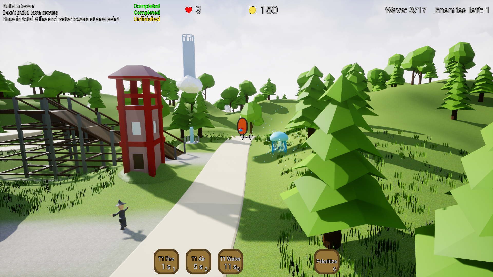  |  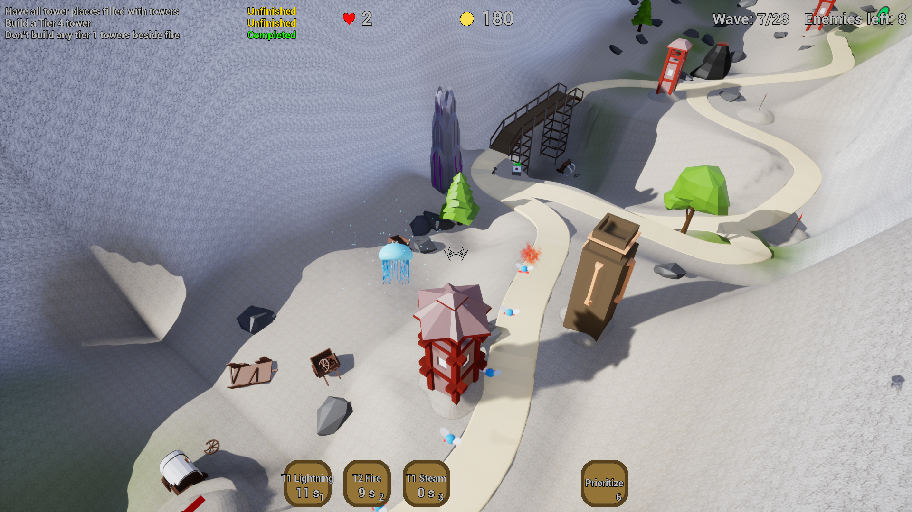
:-------------------------:|:-------------------------:

## Thief's life
2D top down game where you play as a thief trying to rob your way to happy ending. As you progress, the character gets older and his attributes change.

This game, made in Unity engine, was a team project of 4 for a school subject. [link](https://visiongame.cz/hra/thiefs-life/)

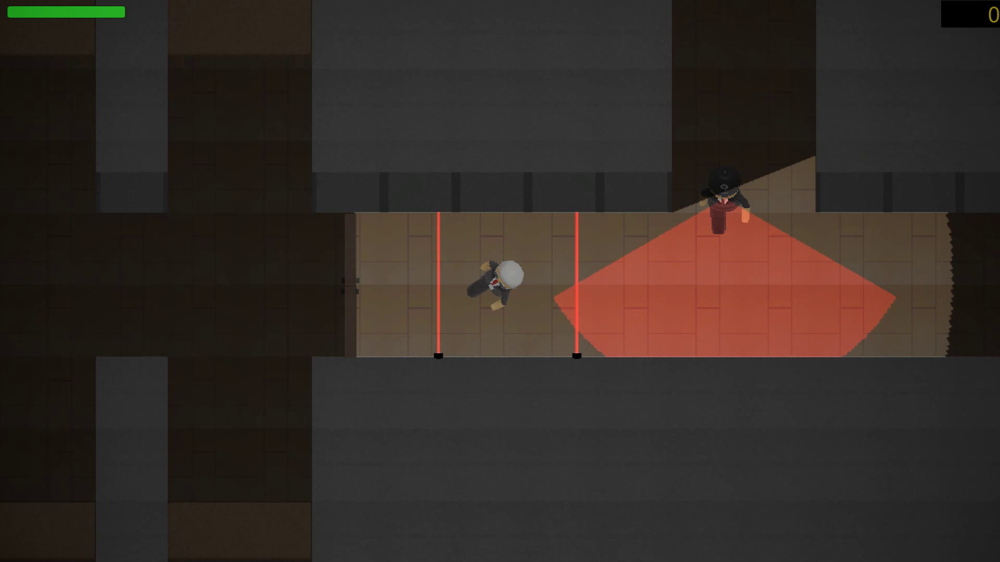  |  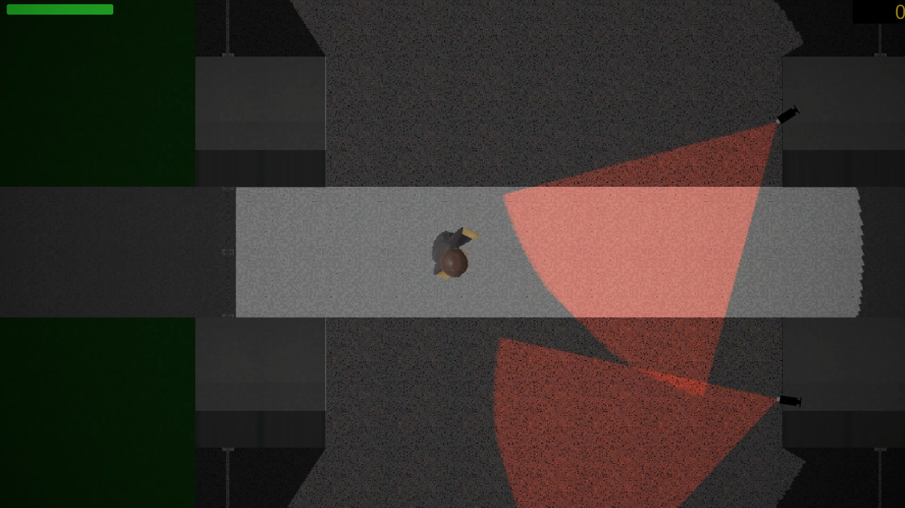
:-------------------------:|:-------------------------:

## Witches dungeon
VR medieval  escape room game, where user needs to solve few puzzles to escape. The game was made in Unity engine by team of 2. [link](https://terylangosh.itch.io/witches-dungeon)

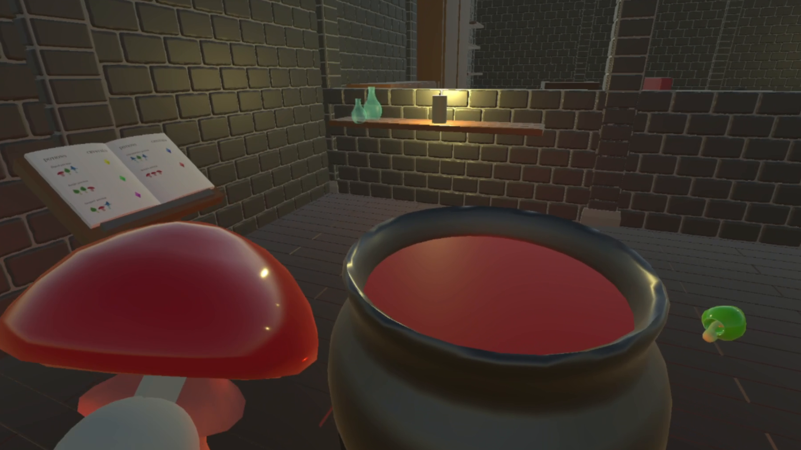  |  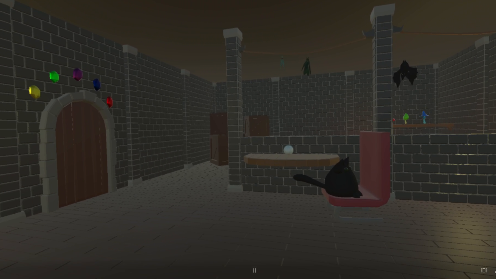
:-------------------------:|:-------------------------:

## Reality fracture
2D platformer puzzle game where multiple realities merge together and you and your alternate selves need to help each other to solve puzzles to fix the reality. A solo project made in Unity. [link](https://marnex2k.itch.io/reality-fracture)

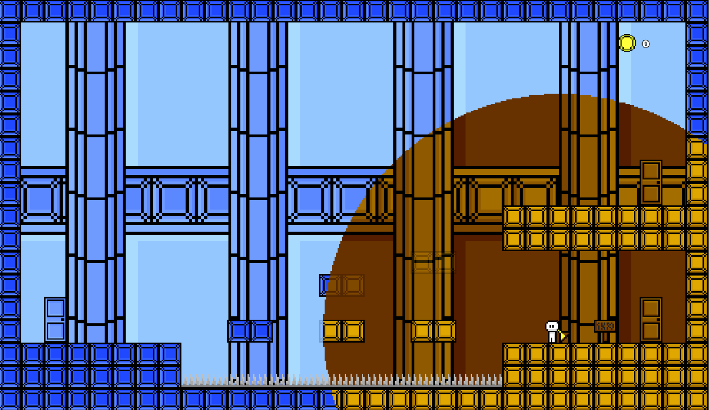  |  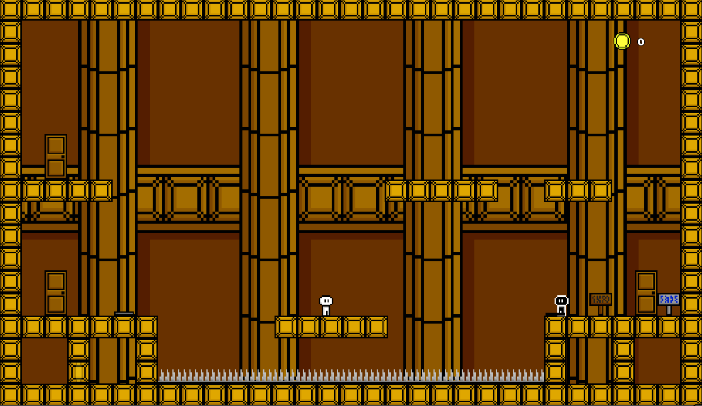
:-------------------------:|:-------------------------:

## Interactive room detection
My master thesis. An implementation of a computer graphics algorithm to generate Rooms and Portals partition based on input of walls in Unity engine. The algorithm splits a scene into separate rooms and generate potentially visible sets for each of the rooms. [link](https://dspace.cvut.cz/handle/10467/114629)

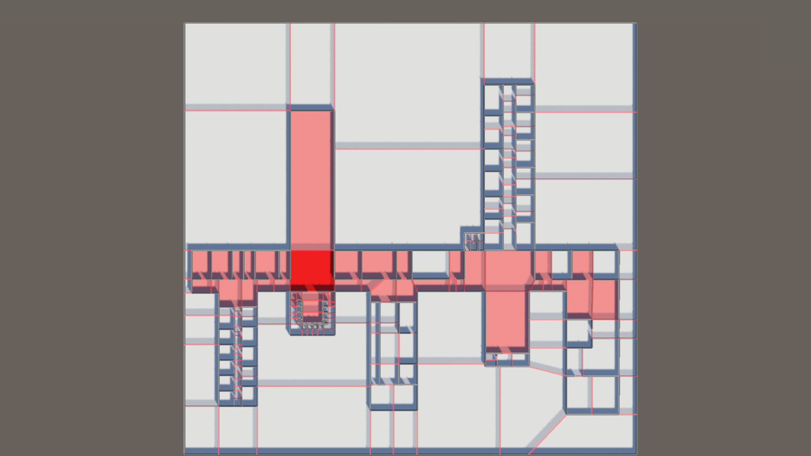  |  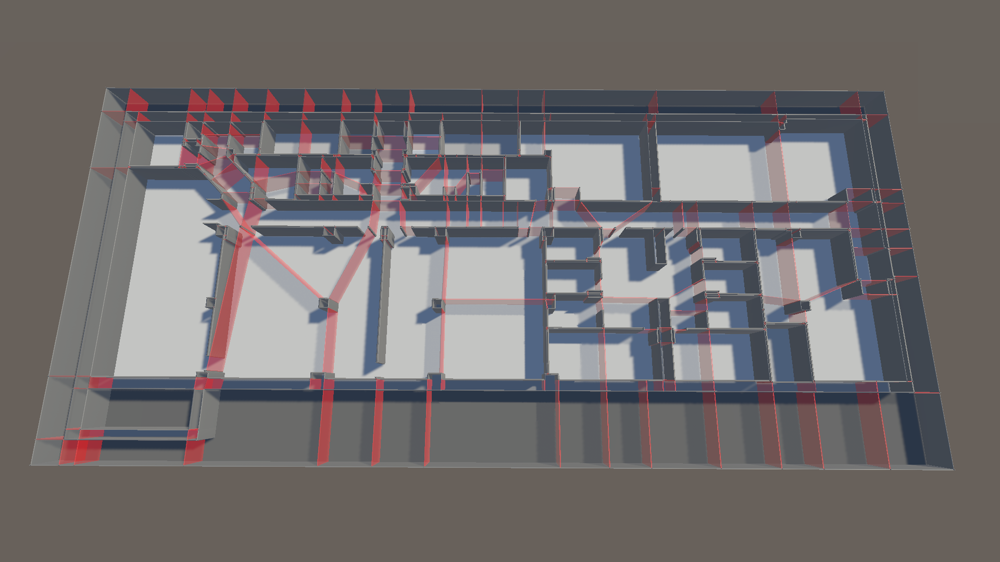
:-------------------------:|:-------------------------:
Potentially visible set    |  Partition to cells and portals

## Modelling
I like to create models and drawing too. These are some models I have created for different subjects. [link](https://github.com/MarNeXD/Modeling)

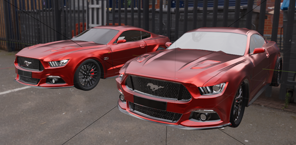  |  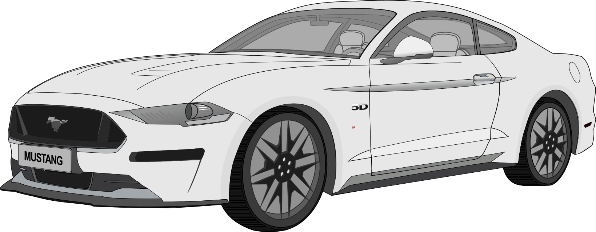
:-------------------------:|:-------------------------:
Ford Mustang GT 3D model (Material, baked textures) | Ford Mustang GT vector graphics

# Tools
- Unity
- Unreal Engine
- Blender
- Inkscape
- Gimp
